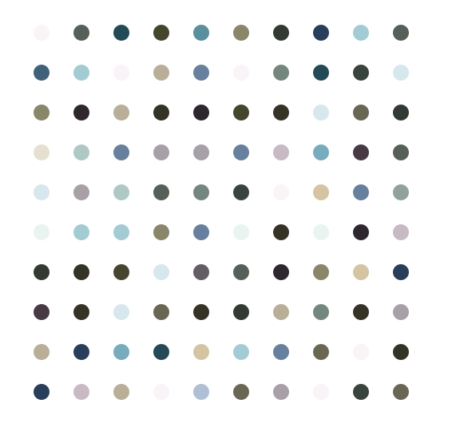

# This is a simple project to create a master piece out of dots

Using the Turtle and Colorgram packages in Python I created a function.

- It takes a image_path as an argument
- The color gram module converts the image and extracts its 30 prominent colours
- Using those colors I programmed with the turtle module to create a 10 by 10 canvas of dots
- This mirrors some of the Damien Hirst dots masterpieces

### Example 1
##### Great Wave of Kanagawa

My dot paiting:

### Example 2
##### Screensaver from macOS Big Sur

My dot paiting:

